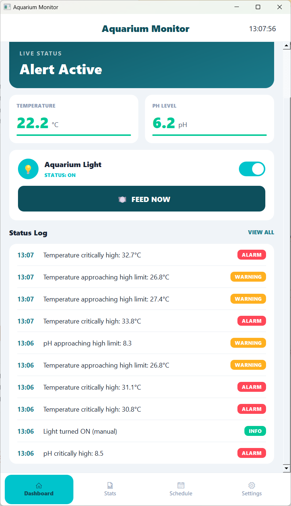
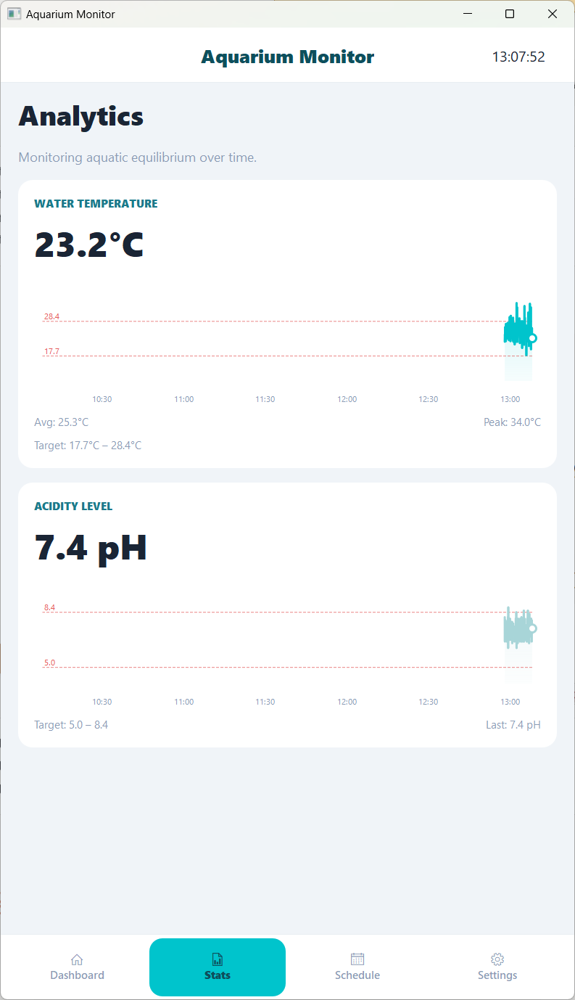
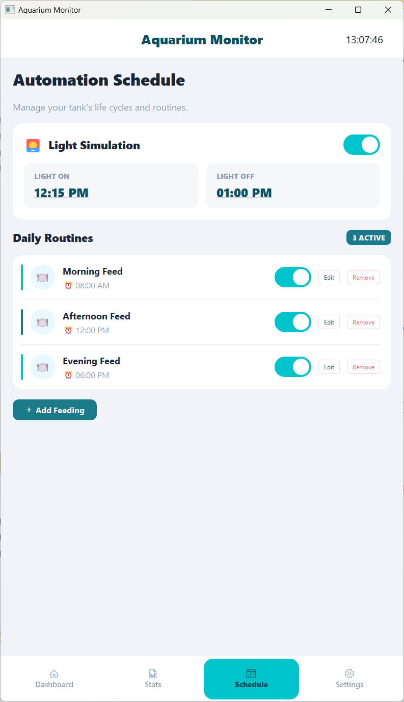
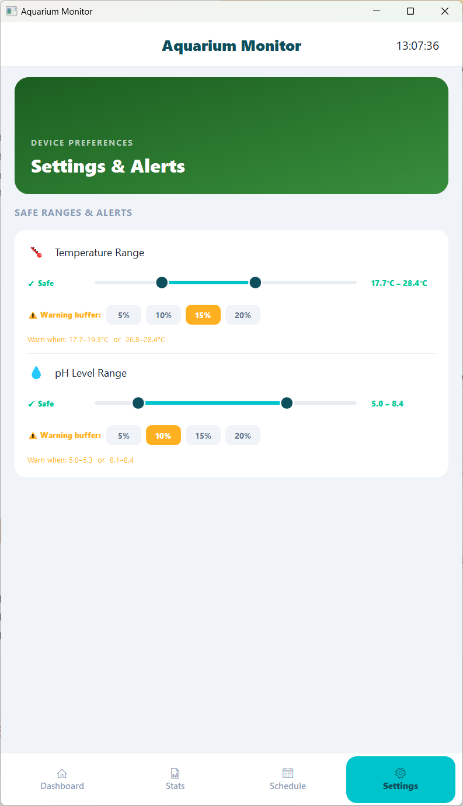

# 🐠 Aquarium Monitor - Smart Aquarium Management System


## Project Overview

Aquarium Monitor is a Python-based IoT system for real-time monitoring and control of a smart aquarium. Three hardware emulators — a temperature/pH sensor, an automatic feeder, and a light relay — communicate over MQTT with a data manager that logs all events to a local SQLite database and issues configurable warnings and alarms. A PyQt5 desktop GUI ties it all together, displaying live sensor data, controls, and a color-coded event log.

## System Architecture

```
[Temp/pH Sensor] ──┐
[Feeding Button] ──┼──► [HiveMQ Broker] ──► [Data Manager] ──► [SQLite DB]
[Light Relay]    ──┘           │
                               └──────────────► [Main GUI]
```

## Application Showcase

### 1. Dashboard

The Dashboard shows live temperature and pH readings with color-coded status indicators (green / amber / red), a manual light toggle, a one-tap "Feed Now" button, and a scrollable event log with a "View All" live popup.

<p align="center"></p>

### 2. Stats

The Stats page displays historical line charts for temperature and pH over a fixed 3-hour window, with dashed target-range lines showing the current safe bounds and running average and peak values.

<p align="center"></p>

### 3. Schedule

The Schedule page manages the automatic feeding timetable — add, edit, enable/disable, or delete named feeding slots — and lets you set the light on/off times. All changes are persisted to the database and published to the relay via MQTT instantly.

<p align="center"></p>

### 4. Settings

The Settings page provides range sliders for adjusting the safe temperature and pH bounds, and percentage buttons for setting the warning buffer (5 / 10 / 15 / 20 % from each edge). Changes apply immediately to the running data manager via MQTT and are saved to the database.

<p align="center"></p>

## Key Features

- **Live sensor monitoring** — temperature and pH updated every 3 seconds with color-coded status (safe / warning / alarm)
- **Three-tier alert system** — safe range, configurable warning buffer, and alarm outside safe bounds; alerts published over MQTT and logged to SQLite
- **Dynamic feeding schedule** — named feeding slots stored in the database; the data manager fires feed commands automatically via a background thread
- **Trigger-based light relay** — fires a single on/off event at the scheduled transition time; ignores schedule between transitions so manual overrides are respected
- **Historical charts** — scrollable line charts with a 3-hour time axis and live target-range lines on the Stats page
- **Persistent thresholds** — safe ranges and warning percentages survive restarts; the data manager loads saved values from the database at startup
- **Live threshold sync** — slider changes in Settings publish immediately to the data manager over MQTT with no restart needed
- **Personal MQTT channels** — each user sets a unique topic prefix via a `.env` file, preventing message collisions on the shared public broker

## Technology Stack

| Component | Technologies |
|-----------|-------------|
| GUI | Python 3, PyQt5 (QMainWindow, QPainter, QScrollArea, QDialog, QTimer) |
| Messaging | MQTT via paho-mqtt, HiveMQ public broker (TCP 1883) |
| Database | SQLite via the built-in sqlite3 module |
| Sensor emulation | Python (paho-mqtt producer loop) |
| Configuration | python-dotenv (.env file for topic prefix) |
| Testing | pytest |

## Project Structure

```
IOT_SMART_HOME/
├── config.py                    # Broker address, topic names, default threshold values
├── requirements.txt             # Python dependencies
├── .env                         # Local topic prefix override (not committed)
├── .env.example                 # Template showing the IOT_USER variable
├── emulators/
│   ├── temp_ph_sensor.py        # Publishes temperature and pH readings every 3 s
│   ├── feeding_button.py        # Handles feed commands and publishes status confirmations
│   └── light_relay.py           # Fires on/off at scheduled times; responds to manual commands
├── data_manager/
│   └── data_manager.py          # Subscribes to all topics, writes to DB, checks thresholds, triggers scheduled feeds
├── gui/
│   ├── main_gui.py              # Entry point: starts MQTT client and launches the PyQt5 app
│   ├── app.py                   # Main window (AquariumApp) and bottom navigation bar
│   ├── palette.py               # Color constants used across all pages
│   ├── state.py                 # Shared in-memory state, MQTT callbacks, DB helpers for allowed_ranges
│   ├── widgets.py               # Reusable widgets: LineChart, RangeSlider, ToggleSwitch
│   └── pages/
│       ├── dashboard.py         # Live readings, controls, and event log
│       ├── stats.py             # Historical line charts for temperature and pH
│       ├── schedule.py          # Feeding schedule management and light on/off times
│       └── settings.py          # Safe-range sliders and warning buffer buttons
├── db/
│   ├── aquarium.db              # SQLite database (auto-created on first run)
│   └── init_db.py               # Standalone script to initialise the database schema
└── tests/
    └── test_sanity.py           # 40 unit tests covering config, alert logic, DB writes, and MQTT payloads
```

## Configuration

The MQTT topic prefix is read from the `IOT_USER` environment variable. Create a `.env` file in the project root:

```
IOT_USER=aquarium_your_name
```

Use the provided template as a starting point:

```
# .env.example
IOT_USER=aquarium_your_name
```

If no `.env` file exists or `IOT_USER` is not set, the system falls back to the default prefix `aquarium_hit_admin`. All five components read `config.py` at startup, so the prefix is consistent across the entire system automatically.

## Quick Start

**Prerequisites**

```bash
pip install -r requirements.txt
```

**Run all five components in separate terminals**

```bash
# Terminal 1 — data manager (start first so no messages are missed)
python data_manager/data_manager.py

# Terminal 2 — temperature and pH sensor emulator
python emulators/temp_ph_sensor.py

# Terminal 3 — feeding button emulator
python emulators/feeding_button.py

# Terminal 4 — light relay emulator
python emulators/light_relay.py

# Terminal 5 — GUI application
python gui/main_gui.py
```

On Windows you can use `py` instead of `python`.

## MQTT Broker Setup

The system uses the **HiveMQ public broker** — no account or password required.

| Setting | Value |
|---------|-------|
| Host | `broker.hivemq.com` |
| Port | `1883` (plain TCP) |

**Monitor live messages in the browser**

1. Go to [https://www.hivemq.com/demos/websocket-client/](https://www.hivemq.com/demos/websocket-client/)
2. Set Host to `broker.hivemq.com`, Port to `8000`
3. Click **Connect**
4. Subscribe to `aquarium_hit_admin/#` (or your custom prefix followed by `/#`)
5. All MQTT messages will appear in real time

## MQTT Topic Map

All topics are prefixed with the value of `TOPIC_PREFIX` (default: `aquarium_hit_admin`).

| Topic | Direction | Description |
|-------|-----------|-------------|
| `{prefix}/sensor/temperature` | Sensor → Broker | Temperature reading in °C |
| `{prefix}/sensor/ph` | Sensor → Broker | pH level reading |
| `{prefix}/feeding/command` | GUI / Data Manager → Broker | Trigger a feed action |
| `{prefix}/feeding/status` | Feeding button → Broker | Feed completed confirmation |
| `{prefix}/light/command` | GUI → Broker | Manual light on / off command |
| `{prefix}/light/status` | Light relay → Broker | Current light state and source |
| `{prefix}/alerts` | Data Manager → Broker | WARNING and ALARM events |
| `{prefix}/config/thresholds` | GUI → Data Manager | Updated threshold values from Settings |
| `{prefix}/config/light_schedule` | GUI → Light relay | Updated on/off schedule times |

## Database Schema

The SQLite database (`db/aquarium.db`) is created automatically on first run by `data_manager.py`.

| Table | Columns | Description |
|-------|---------|-------------|
| `sensor_readings` | id, sensor_type, value, unit, timestamp | Every temperature and pH reading |
| `feeding_events` | id, action, amount, timestamp | Log of all feed commands |
| `light_events` | id, state, source, timestamp | Light state changes with source (manual / schedule) |
| `alerts` | id, level, message, value, threshold, timestamp | All WARNING and ALARM events |
| `feeding_schedules` | id, name, time, enabled | Named feeding slots with enable/disable flag |
| `light_schedule` | id, on_time, off_time | Single row with the light on/off schedule times |
| `allowed_ranges` | key, value | Persisted threshold values including warning percentages |

## Running Multiple Instances

Each user should have a unique `IOT_USER` to avoid messages mixing on the shared public broker. Create a `.env` file with a personal prefix before starting any component:

**User A** (`.env`):
```
IOT_USER=aquarium_alice
```

**User B** (`.env`):
```
IOT_USER=aquarium_bob
```

Each instance will publish and subscribe only to its own set of topics. No other configuration changes are needed.

## Testing

Run the full test suite with:

```bash
python -m pytest tests/ -v
```

The suite contains 40 tests across five groups: config sanity, threshold defaults and fallback logic, alert level classification, database read/write operations, and MQTT payload structure validation.

## AI Assistance

This project was developed with the help of **Claude** (by Anthropic) as an AI pair-programming tool. Claude assisted with architecture decisions, code implementation, debugging, and refactoring throughout the development process.
